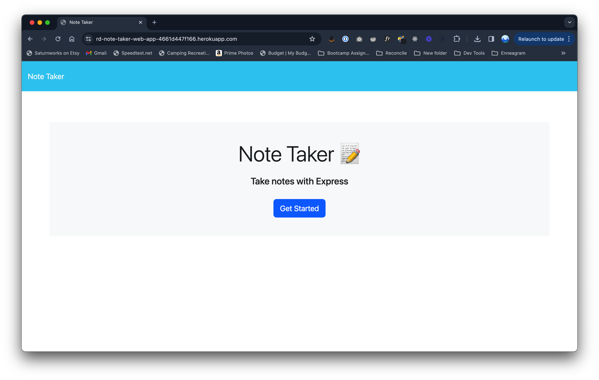
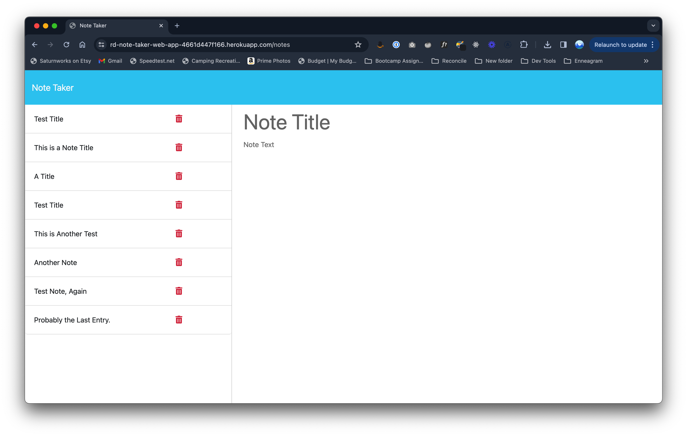
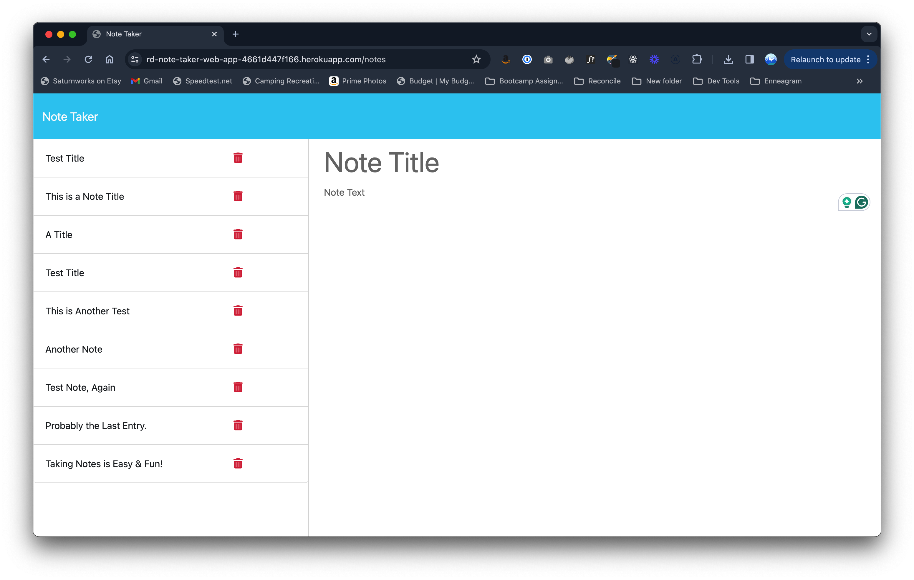

# Note Taker Web App

A simple web application for creating, storing and deleting notes!

## The Repo:

https://github.com/ryandarton/note-taker-web-app

## The Site:

https://rd-note-taker-web-app-4661d447f166.herokuapp.com/

## Screenshots:

## Technologies Used

- Node.js
- Express.js
- JavaScript
- HTML
- CSS
- Bootstrap
- UUID
- Heroku
- Git
- GitHub
- Visual Studio Code

## Questions

- GitHub: [ryandarton](https://github.com/ryandarton)
- Email: ryandarton@gmail.com
